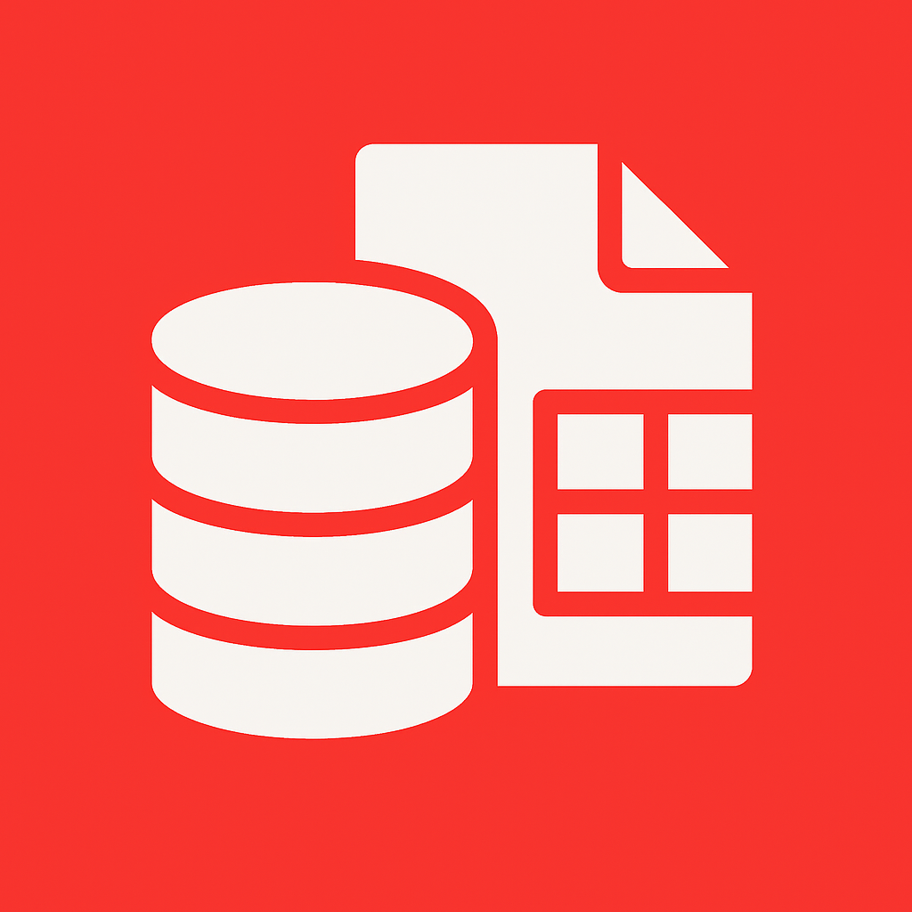

#  KGR Toolbox

A QGIS plugin for managing PostgreSQL database templates and creating portable project archives.

## Features

### PostgreSQL Template Management
- **Create Templates**: Generate database templates from existing PostgreSQL databases without data
- **Deploy Templates**: Create new databases from existing templates
- **Schema Preservation**: Maintain all database structure, constraints, and relationships

### Portable Project Archives
- **PostgreSQL to Geopackage**: Convert all PostgreSQL layers to a single portable geopackage
- **Complete Project Export**: Copy all project files including DCIM folders and media and updates source references

## Installation

### From QGIS Plugin Repository
1. Open QGIS
2. Go to `Plugins` → `Manage and Install Plugins`
3. Search for "KGR Toolbox"
4. Click `Install Plugin`

### Manual Installation
1. Download the latest release from [GitHub Releases](https://github.com/csgis/postgresql-template-manager/releases)
2. Extract the zip file to your QGIS plugins directory:
   - **Windows**: `C:\Users\[username]\AppData\Roaming\QGIS\QGIS3\profiles\default\python\plugins\`
   - **macOS**: `~/Library/Application Support/QGIS/QGIS3/profiles/default/python/plugins/`
   - **Linux**: `~/.local/share/QGIS/QGIS3/profiles/default/python/plugins/`
3. Restart QGIS
4. Enable the plugin in `Plugins` → `Manage and Install Plugins` → `Installed`

## Usage

### PostgreSQL Template Management

#### Creating a Template
1. Open the KGR Toolbox plugin
2. Go to the **Database Connection** tab
3. Enter your PostgreSQL connection details
4. Click **Test Connection**
5. Switch to the **Create Template** tab
6. Select source database and enter template name
7. Click **Create Template**

#### Deploying from Template
1. Ensure your connection is configured
2. Go to the **Create Template** tab
3. Select the template database
4. Enter new database name
5. Click **Create Database**

### Creating Portable Archives

#### Export Project Archive
1. Open your QGIS project with PostgreSQL layers
2. Open the KGR Toolbox plugin
3. Go to the **Archive Project** tab
4. Select output folder
5. Click **Create Portable Archive**

The plugin will:
- Copy all project files and folders (including DCIM)
- Convert all PostgreSQL layers to a single geopackage
- Update the project file to use geopackage sources
- Create a portable `_portable.qgs` file

#### Warning
The archive process copies ALL files from your project directory, including DCIM folders which may be quite large. Choose your output location carefully.

## Requirements

- QGIS 3.0 or higher
- PostgreSQL database with appropriate permissions
- Python 3.6+ (included with QGIS)

## Technical Details

### Manual Template Creation

If you prefer to create templates manually, you can execute these SQL commands directly in any PostgreSQL client (DBeaver, pgAdmin, etc.):

```sql
-- 1. Connect to postgres database and terminate active connections to source database
SELECT pg_terminate_backend(pid) 
FROM pg_stat_activity 
WHERE datname = 'source_database_name' 
  AND pid != pg_backend_pid();

-- 2. Create template database
CREATE DATABASE "template_database_name" 
WITH TEMPLATE "source_database_name" 
     IS_TEMPLATE = true;

-- 3. Connect to the template database

-- 4. Truncate all user tables to remove data while preserving structure
DO $$
DECLARE
    table_record RECORD;
BEGIN
    FOR table_record IN 
        SELECT schemaname, tablename 
        FROM pg_tables 
        WHERE schemaname NOT IN ('information_schema', 'pg_catalog', 'pg_toast')
        ORDER BY schemaname, tablename
    LOOP
        EXECUTE format('TRUNCATE TABLE %I.%I CASCADE;', 
                      table_record.schemaname, 
                      table_record.tablename);
        RAISE NOTICE 'Cleared data from %.%', 
                     table_record.schemaname, 
                     table_record.tablename;
    END LOOP;
END $$;
```

**Template Deployment:**
```sql
-- Create new database from template
CREATE DATABASE "new_database_name" 
WITH TEMPLATE "template_database_name";
```

**Template Deletion:**
```sql
-- Deactivate template status first
UPDATE pg_database 
SET datistemplate = false 
WHERE datname = 'template_database_name';

-- Drop the template database
DROP DATABASE "template_database_name";
```

## Troubleshooting

### Common Issues

**Connection Failed**
- Verify PostgreSQL server is running
- Check host, port, and credentials
- Ensure user has appropriate permissions

**Template Creation Failed**
- Ensure user has CREATEDB privileges
- Check database name doesn't already exist
- Verify sufficient disk space

**Archive Export Failed**
- Check write permissions in output folder
- Ensure sufficient disk space
- Verify QGIS project is saved

### Getting Help
- Check the [Issues](https://github.com/csgis/kgr_toolbox/issues) page
- Create a new issue with detailed description
- Include QGIS version, PostgreSQL version, and error messages

## License

This project is licensed under the GNU General Public License v3.0 - see the [LICENSE](https://opensource.org/license/mit) file for details.